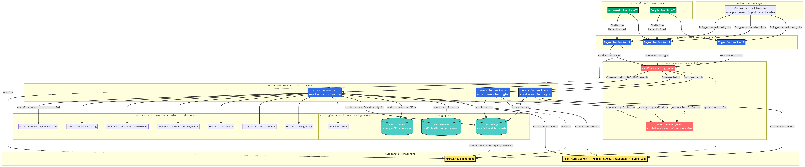

# Email Security System 

## Running the System

### Prerequisites
- Docker
- Make CLI

### Quick Start
```bash
# 1. Up the containers & execute the binary
make run

# 2. View results in console output
# High-risk emails are logged with 🚨 prefix showing:
#   - Subject, sender, risk score, risk level
#   - Detected threats with confidence and evidence

# 3. Execute tests  
make test
```

## Overview

This is an email security system that analyzes (mocked) emails using based rules fraud detection strategies, and flags high-risk messages.


**What was built**: Email retrieval service with a 3-phase pipeline (ingestion → detection → reporting), fraud detection engine with rule-based strategies, and PostgreSQL storage layer with scaling considerations.

**Considerations** : This project aims to be some hours long. The current state of the art is using an hybrid strategy combining rules based and Machine Learning detections with human feedback on very low / critical risks. For simplicity, we'll focus on rule based and describe our "at scale" strategy in our architecture proposal.

**Technology stack**: Go 1.21, PostgreSQL 15, Docker


## Disclaimer 

This technical assessment leveraged Claude Code to accelerate specific implementation tasks while maintaining human oversight of core architectural decisions and business logic. AI assistance was employed in the following areas:

- **Build Automation**: Generation of Makefile targets for development workflow
- **Documentation**: Human-authored technical explanations enhanced with AI-generated detailed commentary and inline code documentation
- **Test Suite Development**: Template-based test generation from human-written reference implementations using table-driven testing patterns
- **Algorithm Implementation**: Standard algorithms (e.g. Levenshtein distance for typosquatting detection)
- **Strategy Scaffolding**: Boilerplate code generation for detection strategy pattern implementations
- **Repository**: Scaffolding repository methods based on database schema

All fraud detection logic, confidence thresholds, risk scoring mechanisms, and architectural patterns were designed and validated by the author.

## Academic papers reading & sources

1. **Business email compromise (BEC) in the Age of Detection: A Systematic Review** (2025)
   *Computers & Security*, ScienceDirect
   [https://www.sciencedirect.com/science/article/pii/S0167404825003190](https://www.sciencedirect.com/science/article/pii/S0167404825003190)

2. **2024 Internet Crime Report** (2024)
   *FBI Internet Crime Complaint Center (IC3)*
   [https://www.ic3.gov/AnnualReport/Reports/2024_IC3Report.pdf](https://www.ic3.gov/AnnualReport/Reports/2024_IC3Report.pdf)

3. **Email Authentication Mechanisms: DMARC, SPF and DKIM** (2016)
   *NIST Technical Note 1945*, National Institute of Standards and Technology
   [https://nvlpubs.nist.gov/nistpubs/TechnicalNotes/NIST.TN.1945.pdf](https://nvlpubs.nist.gov/nistpubs/TechnicalNotes/NIST.TN.1945.pdf)

4. **Business Email Compromise: A Comprehensive Taxonomy**
   *University of Southampton, eprints*
   [https://eprints.soton.ac.uk/499327/1/3700706.3700714.pdf](https://eprints.soton.ac.uk/499327/1/3700706.3700714.pdf)

The **2024 IC3 Internet Crime Report** highlights a record-breaking year for cybercrime, with **$16.6 billion in reported losses** (a 33% increase from 2023) across over 850,000 complaints. The report emphasizes the devastating impact on the elderly, the continued threat of Business Email Compromise (BEC) and ransomware. The other papers helped us finding the attack strategies and how the current state of the art answers it. This has helped structuring this test and understanding its purpose.

## Architecture

### Softtware Architecture

The system implements **hexagonal architecture** (ports & adapters pattern) with clear separation between business logic and infrastructure:

- **Domain Layer** (`internal/domain`): Pure business logic - detection strategies, risk scoring, domain models
- **Application Layer** (`internal/application`): Use case orchestration - fraud detection service
- **Adapters Layer** (`internal/adapters`): External integrations - Google/Microsoft clients, PostgreSQL storage
- **Ports Layer** (`internal/ports`): Interface contracts - `EmailProvider`, `Storage`

### Scaling Architecture



**Architecture**: Distributed queue-based system with RabbitMQ, stateless detection workers, partitioned PostgreSQL, and Redis caching.

**Main bottleneck**: PostgreSQL query latency

**Key Components**:
- **Ingestion Service** → RabbitMQ queues → **Detection Workers** (horizontally scalable)
- **PostgreSQL** with monthly partitioning + read replicas for reporting
- **Redis** cache for user lookups and trusted domains
- **Dead Letter Queue** for failed messages after retries

**Why It Scales**:
- Stateless workers scale linearly without coordination
- Queue-based decoupling enables independent service scaling
- Monthly partitioning improves query performance and allows dropping old data
- Webhook subscriptions from providers (real-time vs polling)

## Email Retrieval Service

The service implements a **3-phase pipeline**:

### Phase 1: Ingestion
- Fetch users from mocked provider API (Microsoft / Gmail API)
- Store users with upsert pattern
- Fetch emails for each user (last 7 days by default)
- Idempotent storage via `ON CONFLICT` clauses

### Phase 2: Detection
- Fetch batch of unprocessed emails
- Look up recipient user for role-based detection
- Run all detection strategies
- Calculate weighted risk score (0.0-1.0)
- Store analysis results and mark email processed

### Phase 3: Reporting
- Query high-risk emails from database
- Display in console => Production should be alerting system, slack, email + human review / feedback in critical & low risks. 

**Provider abstraction**: The `EmailProvider` interface allows supporting multiple providers (Google, Microsoft) dynamically based on tenant configuration. Currently mocked for prototype; production would implement authentication token refresh and rate limiting.

## Fraud Detection Features

Detection strategies implemented, each targeting specific attack patterns :

1. **Display Name Mismatch** - Detects CEO fraud via executive title impersonation (e.g., "Robert Johnson, CEO" from external domain). Confidence: 0.85

2. **Domain Typosquatting** - Detects similar-looking domains using Levenshtein distance (micros0ft.com vs microsoft.com, 85% similarity threshold). Confidence: 0.90. Could be using fuzzy matching or ngram 

3. **Auth Failures (SPF/DKIM/DMARC)** - Detects email spoofing via header analysis. Requires 2+ failures (single failure can be legitimate email forwarding). Confidence: 0.80

4. **Urgency + Financial Language** - Detects BEC attacks combining urgency + financial keywords. Weighted scoring: urgency (30%), financial (50%), authority (20%). Triggers if score > 1.5. Confidence: 0.70-0.95

5. **Reply-To Mismatch** - Detects Reply-To redirects to free email services (Gmail, Yahoo) when sender domain differs. Confidence: 0.75

6. **Suspicious Attachments** - Detects high-risk executables (.exe, .bat, .vbs), double extensions (invoice.pdf.exe), and medium-risk documents (.doc, .xls) with urgency. Confidence: 0.70-0.90

7. **BEC Role Targeting** - Most sophisticated strategy:
   - C-Suite targeting (CEO/CFO + urgent + wire transfer): 0.90
   - Finance targeting (finance role + wire transfer): 0.85
   - HR & payroll : 0.80
   - Generic high-value targets: 0.70

**Risk scoring**: Uses **weighted maximum** approach (not average). Rationale: One strong signal should flag email; averaging dilutes detection. BEC attacks typically have 1-2 very strong indicators. Weights favor high-confidence signals: Domain Typosquatting (1.5x), BEC C-Suite (1.6x), High-risk attachments (1.5x).

**Weighted maximum** and **confidence** are purely heuristic based on readings. Should be finetuned manually with human feedback.

## Key Design Decisions & Tradeoffs

### 1. Hexagonal Architecture
- **Why**: Testability, provider switching, framework independence
- **Tradeoff**: More files/abstractions (ports + adapters) vs simpler monolithic structure. Worth it for maintainability and testing.

### 2. Weighted Maximum Risk Scoring (not average)
- **Why**: One strong signal sufficient to flag email. BEC attacks have 1-2 strong indicators (typosquatting + C-suite targeting). Averaging dilutes: 10 weak + 1 strong = medium score (bad). Weighted max preserves: 10 weak + 1 strong = high score (good).
- **Tradeoff**: May be more sensitive (higher false positive rate) vs averaging which is more conservative. Tuned based on FBI IC3 case studies.

### 3. Mocked Provider APIs
- **Why**: Prototype focus on architecture and detection logic. Mocks return representative fraud scenarios.
- **Production gap**: Needs OAuth implementation with token refresh, rate limiting, retry, webhook subscriptions for real-time...

### 4. Sequential Processing
- **Why**: Simpler for prototype demonstration. Single binary runs entire pipeline synchronously.
- **Production gap**: See Architecture section.

### 5. PostgreSQL Schema Design
- **Current**: Single `recipient_email` column, JSONB for attachments/headers, `body_preview` (500 chars)
- **Production**: Range partitioning on `received_at` (monthly), separate normalized `recipients` and `threats` tables, S3 for full email bodies
- **Tradeoff**: Prototype focus on simplicity

## Handling Failures & Spikes

### Failure Resilience
- **Individual failure isolation**: User fetch fail ≠ entire tenant fail. Email analysis fail ≠ batch fail. Logged and continued.
- **Idempotent operations**: `ON CONFLICT (tenant_id, provider_message_id) DO NOTHING` for emails. Upsert for users.
- **At-least-once processing**: Email stays unprocessed if analysis storage fails. No data loss.
- **Dead-letter queue** (at scale - see architecture diagram): Failed emails after N retries go to DLQ for manual investigation

### Spike Handling
- **Queue backpressure**: Workers consume at sustainable rate. Queue depth grows temporarily, drains when spike ends.
- **Auto-scaling**: Kubernetes HPA (Horizontal Pod Autoscaler) based on queue depth. Scale from 10 → 50 workers during spike.
- **Priority queues**: High-value tenants (enterprise clients) processed first

### Architectural Tradeoffs

- **Latency**: Email enters queue, waits for worker availability, then processed. End-to-end latency can be to slow for a "real time" analysis. 
- **Infrastructure complexity**: Multiple services (ingestion, detection, reporting), network calls between components, deployment orchestration, queues, databases, reporting ... 
- **Async processing** : Ingested mails at 1PM can the processed after ingested mails at 1:01PM. Same goes for tenants. All their emails might not be processed by the same worker at the same time.
- **Optimization Dilemma** : State of the art suggests using machine learning aglrotihms coupled to rules based systems. Machine Learning can be slow and costly to run. Even more on load and at scale. Is it necessary for all emails ? If so, can we optimize the workers to scan only the required emails using ML ? 
- **Cost**: More operational services, coordinating deployments, managing inter-service contracts.

